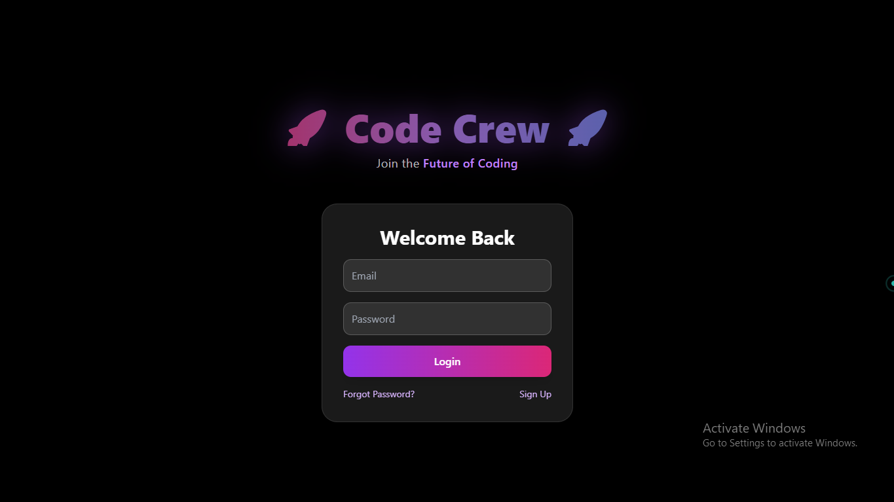
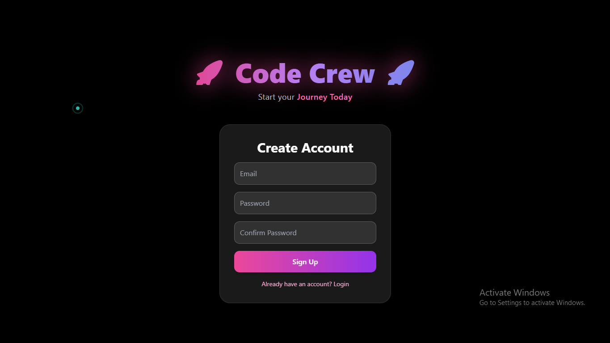
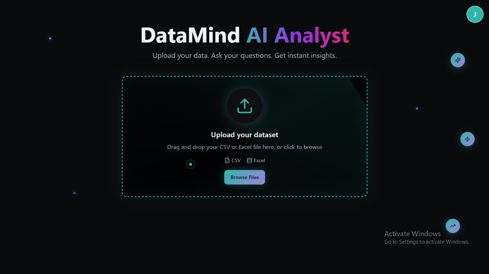
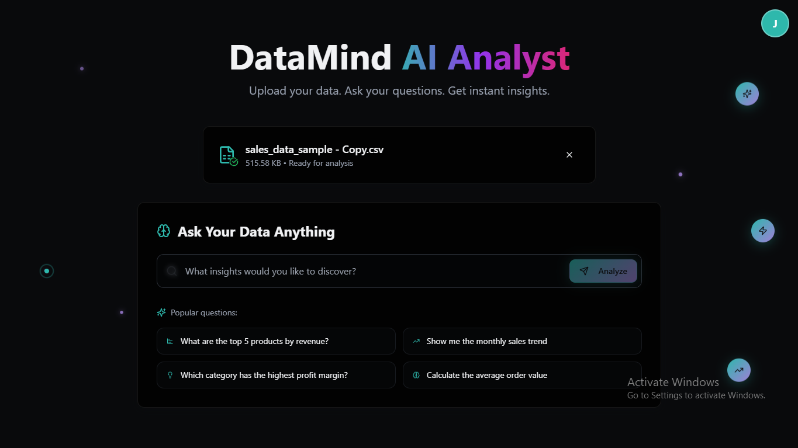

# AI Data Analyst Assistant

[](https://codecrewai.netlify.app/)  
[](https://www.python.org/)  
[](https://reactjs.org/)  

**Try it live:** [AI Data Analyst Assistant](https://codecrewai.netlify.app/)  


# Website Preview

Check out my website: [Live Site](https://codecrewai.netlify.app/)


<div style="display: flex; flex-wrap: wrap; gap: 10px;">
  
  
  
  
</div>


> **AI-Powered Data Analysis at Your Fingertips** 🚀  
> Ask natural language questions about your datasets, get SQL queries generated automatically, and view actionable insights instantly!

---

## 🌟 Key Features

- **Natural Language Processing (NLP):**  
  Ask complex questions in plain English without writing SQL.  

- **AI-Powered SQL Generation:**  
  Leverages Google Gemini API to generate accurate SQL queries automatically.  

- **Data Analysis Support:**  
  Works with `.csv` and `.xlsx` files for immediate insights.  

- **Clean Web Interface:**  
  Responsive and user-friendly React frontend built with Vite.  

- **Instant Results & Visual Feedback:**  
  Execute queries and get results instantly with summary and optional chart view.

---

## 🛠️ Tech Stack

### Backend
- **Framework:** Python Flask  
- **Libraries:** Pandas, Pandasql, Flask-CORS, python-dotenv  
- **AI Model:** Google Gemini (optional)  

### Frontend
- **Framework:** React (Vite)  
- **UI:** Responsive and modern interface  

### Environment Management
- Python virtual environment (`venv`)  
- `.env` file for configuration (API keys, etc.)

---

## ⚙️ Setup & Installation

### Prerequisites
- Python 3.8+  
- Node.js & npm  

---

### 1️⃣ Clone the Repository
```bash
git clone <your-repository-url>
cd data-analyst-ai
